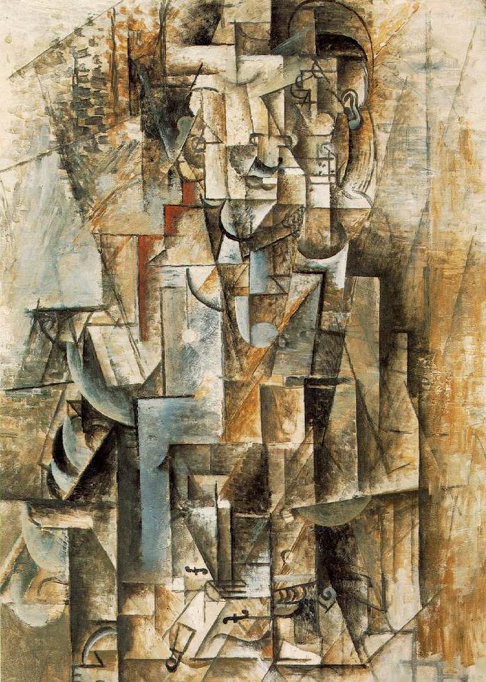
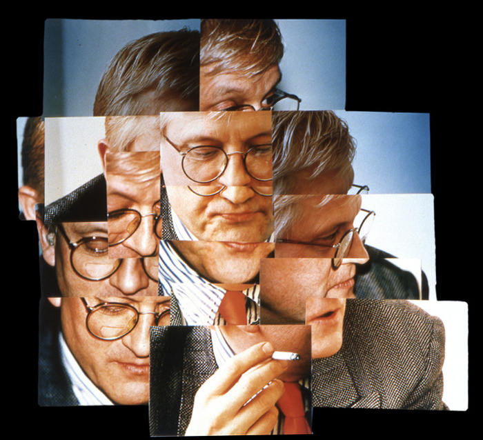
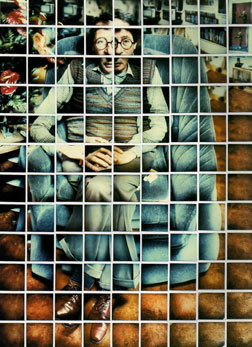
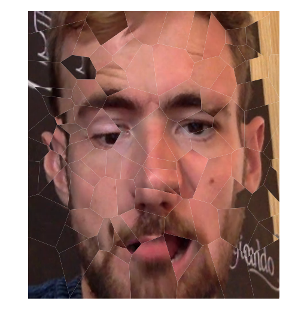

# AUTOJOINERS

An Art Program which builds cubist portraits in the tradition of early Picasso or Hockney.

## WHAT?

Tba

## WHY?

Tba

## HOW?

Run the script 'create_face_image.py' from the command line.
#### Required arguments:
Specify the mode. Currently supported: 'webcam' or 'file <filename>'.
The program will take input either from your webcam or the specified movie file, respectively.

#### Optional flags:
* <b>`-size <int> <int>`</b>: specify the output canvas size. Default 800x600.
* <b>`-nregions \<int\>`</b>: specify the number of regions to divide the canvas into. Default 100.
* <b>`-pertubation <int>`</b>: add a random pertubation to each constituent image. X,Y pertubations are normally distributed with mean 0 and variance this parameter; default 0.
* <b>`-shatter <str>`</b>: choose the style of shatter to use to divide the canvas. Currently supported:
  * `Voroi`: (default) a random, relatively even, nonoverlapping division of the canvas.
  * `RandQuadrilaterals`: randomly selected irregular quadrilaterals.
  * `RandRectangles`: randomly selected rectangles, aligned with the canvas edges.
  * `HockneySquares`: a regular array of squares in a pleasing style used by Hockney, eg:
   
* <b>`-filename <str>`</b>: the file name for the output image. Default is 'output.jpg'.

#### Example:
Try `python create_face_image.py file examplemov.mov -size 800 700 -filename sampleoutput.jpg -shatter Voroi`

